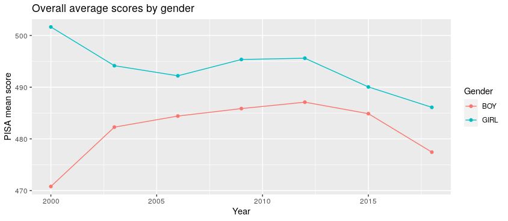
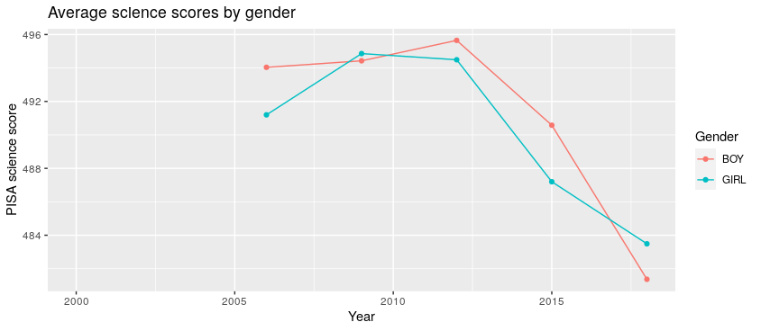

# Enquête sur l'indicateur de PISA
Note collective pour le cours La vie sociale des données
Markéta Ovečková &amp; Michal Kubala &amp; Vojtěch Holík

## Introduction: Qu'est-ce que PISA ?

Le Program for International Student Assessment (PISA) est une enquête conçue pour suivre et évaluer les acquis des élèves. La première étude a eu lieu en 2000 et a été reprise tous les trois ans depuis, avec une pause en 2021 due à la pandémie Covid-19. L'enquête la plus récente a eu lieu en 2022 dont les résultats ne sont pas encore disponibles. 

Cette évaluation est menée par l'OCDE et vise à tester les compétences des élèves de 15 ans en lecture, sciences et mathématiques. Elle est destinée aux élèves de tous horizons, qu'ils soient scolarisés dans les établissements publics ou publics sous contrat, dans les lycées ou dans les établissements d'enseignement agricole, général, technologique ou professionnel. 

L'objectif est tout d’abord de comparer les performances des élèves issus de différents environnements d'apprentissage afin d’évaluer leur compétence à mobiliser leurs acquis scolaires et à les utiliser dans des situations de la vie quotidienne. En tant que tel, le programme permet d'identifier les facteurs susceptibles d'influencer les performances des élèves, tels que les facteurs socio-économiques.  

Ensuite, il est important de noter que les tests sont standardisés entre les différents pays participants (au nombre de 80 environ).  Cela signifie que PISA est utilisé comme une mesure des performances des élèves permettant la comparaison entre les différents pays et donc l'efficacité des différents systèmes éducatifs.

En France, l'enquête est réalisée sous la responsabilité du Ministère de l'Éducation nationale selon les procédures standardisées de l'OCDE. En 2022, elle se déroulait au sein de 335 établissements tirés au sort pas une autorité internationale indépendante. Dans chaque établissement, environ 30 élèves de 15 ans sont retenus aléatoirement. 

L'ensemble de l'évaluation dure au total 3,5 heures et se décompose en quatre séquences. Tout d'abord, les élèves effectuent un test de compréhension de l'écrit, suivi d'un test de deux heures sur les compétences mathématiques, la culture scientifique et la pensée créative. Enfin, les élèves remplissent un questionnaire de 50 minutes, axé sur leur milieu socioculturel et leur bien-être au lycée ou au collège. Les réponses des élèves sont ensuite réunies et analysées afin d’étudier le système éducatif de leur pays. 

## Difficultés de ses usages et possibles critiques

Comme évoqué dans la première partie, l'objectif principal de PISA est de mesurer les performances scolaires pour les comparer entre les pays de l'OCDE et d’autres pays partenaires. Bien que cette pratique ne doive pas être a priori problématique, les conclusions tirées de ces comparaisons peuvent susciter plusieurs critiques. 

Tout d'abord, selon ses concepteurs, PISA vise à mesurer “l'efficacité des systèmes éducatifs”. Toutefois, la notion de l'efficacité est plutôt subjective, ce qui nous invite à nous interroger : comment définir un système scolaire efficace ? Selon les experts, le sens de l'éducation ne repose pas uniquement sur la préparation à la vie professionnelle, mais également sur la capacité à comprendre les développement du monde dans tous les aspects possibles. Les questions suivantes sont récurrentes tout au long de l'introduction de PISA et ne cessent d'être évoquées jusqu’à aujourd'hui (Sjøberg, S., 2012) :
- PISA est-il à mesure d’évaluer un concept aussi compliqué que l’efficacité scolaire ? 
- Est-il possible de comparer l'enseignement dans des pays aussi différents que la Finlande, l'Arabie Saoudite ou le Brésil ?
- De quoi parlons-nous lorsque nous évoquons l'investissement dans l'enseignement ? 
- S'agit-il de la rémunération des enseignants et du nombre de personnel, de l'investissement dans le matériel scolaire, des technologies utilisées en classe ou encore dans l'infrastructure des écoles ?
- Serait-il possible d'agréger tous ces facteurs et, en les combinant avec les résultats PISA des élèves, de tirer des conclusions sur l'efficacité des systèmes scolaires ? 

Ensuite, il est possible de s'interroger sur la généralisation au niveau national afin de permettre une comparaison au niveau international. Étant donné que plusieurs facteurs sont difficilement comparables, même au sein d'un même pays, la portée internationale des scores PISA peut être biaisée sur des nombreux plans. Parmi d'autres, il est possible d'évoquer les différences entre les établissements privés et publics, entre les écoles dans les grandes villes et celles dans les villages, ou encore à travers des régions entières. Quand on compare les pays par leurs scores PISA moyens, ces nuances et différences internes restent cachées : la réalité des performances scolaires devient simplifiée. En République tchèque par exemple, les écoles de Prague et d’autres grandes villes sont parmi les meilleures sur le classement PISA au niveau international, tandis que les écoles des régions les moins développées du pays atteignent des scores au-dessous de la moyenne de l’OCDE. Même s’il est possible de conduire des études complexes avec des régressions multivariables et avec des designs ingénieux, il va y toujours avoir des variables qui jouent un rôle important mais ne sont pas mesurables et sont alors absentes de chaque modèle explicatif (Pupala, B., 2011). Par conséquent, l'objectif initial de PISA de mesurer l'efficacité des systèmes éducatifs reste limité à cause des problèmes ci-évoqués ainsi que de sa généralisation trop élevée qui peut rendre la possibilité de comparaison discutable..

Par ailleurs, à la toute fin de l'enquête, les élèves répondent à des questions plus ouvertes portant sur leur sentiment général à l'école. La première question porte sur la mesurabilité et sur le bien-être au sein des écoles. Par sa nature, ce facteur est très subjectif et n'est pas facile à mesurer à l'échelle mondiale, à cause des différences culturelles fondamentales : ce qui peut sembler stressant pour un élève d’un pays X ne doit pas nécessairement l’être pour un élève d’un pays Y etc. (Sjøberg, S., 2012). 

En France, PISA fait l'objet des travaux de plusieurs sociologues, notamment de Baudelot et Establet. Comme évoqué dans leur ouvrage L'élitisme républicain paru en 2009, “la justice sociale et l'efficacité d'un système scolaire ne se réduisent pas à la mesure des écarts de résultats entre classes sociales ou pays d'origine des élèves.” (Baudelot Ch., Establet R, 2009, p. 99). Baudelot et Establet constatent que cette enquête de l'OCDE a “mille défauts”, surtout à cause de l'usage de ces résultats dans la pratique. Ce qu’ils évoquent notamment c’est l'interprétation réductrice dans les médias, la semi-confidentialité des résultats par les politiciens, ainsi que la méfiance de côté des enseignants vis-à-vis la culture de l'évaluation des performances des élèves (Baudelot Ch. Establet R, 2009, p. 11).

Toutefois, en analysant les résultats de l'enquête, Baudelot et Establet examinent les difficultés du système éducatif français et sa contribution à la reproduction des inégalités sociales. Grâce à cet exercice de comparaison à grande échelle qu’offre PISA, ils concluent qu'il est possible de pointer un même ensemble de causes des problèmes de l'école française : “l'élitisme républicain de notre école, sa culture du classement et de l'élimination précoce, sa tolérance aux inégalités et à leur reproduction” (Baudelot Ch., Establet R, 2009, p. 10). Par ailleurs, ils suggèrent que les résultats de PISA peuvent montrer des pistes de progrès “non seulement parce qu'elles révèlent que d'autres pays font mieux que nous, mais aussi parce qu'elles permettent de comprendre pourquoi et comment ils font mieux que nous.” D'après eux, PISA aide à identifier des principes généraux qui pourraient conduire à des améliorations des systèmes éducatifs (Baudelot Ch., Establet R, 2009, p. 12). En revanche, selon les chercheurs tchèques fournissant des études aux Ministère de l'éducation et associations éducatives, PISA ne permet pas de comprendre le contexte qui se cache derrière ces résultats (Feřtek T., 2013). Comme l'ont noté plusieurs observateurs, “l'école française est l'une des meilleures du monde… pour une petite moitié de ses élèves, et l'une des plus mauvaises pour l'autre moitié” (Baudelot Ch., Establet R, 2009, p. 14). Ainsi, les résultats de PISA peuvent servir de base à des interprétations nationales (Salles F., 2014) et éventuellement mener à l'amélioration du système éducatif d'un pays.

Que mesure donc réellement PISA ? Ses résultats publiés tous les trois ans peuvent révéler plusieurs tendances systémiques au sein de différents pays. Cela peut ensuite permettre une comparaison au niveau international et dans le temps. L'un de ces facteurs révélateurs est le genre. On constate, par exemple, que les scores des filles en lecture sont toujours plus élevés que ceux des garçons dans une grande majorité de pays.

L’objectif de notre travail est donc de montrer les usages heuristiques les plus fréquents des scores PISA et leurs limitations les plus importantes. Nous traitons notamment les enjeux liés à l'interprétation des facteurs qui peuvent expliquer les différences entre les scores de PISA de différents pays. Ensuite, on aborde la question si les performances de PISA mettent en lumière les réussites scolaires au niveau national.

## Visualisation de la base de données et interprétation

Afin d’analyser les indices PISA, nous avons traité les données disponibles sur le site de l’OCDE et nous en avons produit les visualisations suivantes. Notre code R est déposé dans le fichier du projet sur ce site.

### La différence entre les scores des filles et des garçons par discipline de 2000 à 2018 

  
  
   
  

Sur les 4 graphiques ci-dessus, on observe les différences entre les scores PISA des filles et des garçons en moyenne et dans les trois disciplines : la lecture, les mathématiques et les sciences. L'écart plus grand entre les scores des filles et des garçons en 2000 s'explique par le fait que cette année-là, seulement des tests en lecture ont été faits. En tout cas, les filles performent en général mieux que les garçons dans les tests PISA. Les filles réussissent en moyenne de 30 points PISA de mieux que les garçons en lecture tandis que les garçons de 5 à 10 points en mathématiques. En sciences, les scores sont étonnamment similaires. Ces résultats résonnent bien avec les recherches de Baudelot et Establet qu'on a précédamment mentionnées (Baudelot Ch., Establet R, 2009, p. 99). Pour les 3 disciplines, on constate que les résultats moyens, notamment en mathématiques pour les garçons et sciences pour les deux genres, diminuent progressivement dans le temps. Cela signifie-t-il que les élèves apprennent moins dans ces matières aujourd'hui qu'il y a 20 ans  ? Peut-on garantir le même niveau de difficulté dans les tests PISA d'une année à l’autre ? Ces-questions-là n'annulent pas les constatations qu'on a fait, mais elles nous rappellent qu'il est nécessaire d'interpréter les résultats statistiques avec caution.  

### La distribution des résultats PISA par discipline par pays

Le graphique suivant montre les résultats par discipline de chaque pays de 2000 à 2018. Les points noirs représentent les résultats PISA moyens des pays entre 2000 et 2018, les points colorés indiquent les résultats par discipline pour chaque année où le pays concerné a participé aux tests. Bien que l'écart entre le score moyen le plus élevé (celui de la Finlande) et le score moyen le plus bas (celui de l’Inde) soit assez important (près de 160 points), la grande majorité des scores moyens des pays se situent entre 475 et 525. Nous voyons que les performances des pays sont plutôt constantes dans le temps. La Finlande, par exemple, n’a jamais obtenu de résultats inférieurs au score moyen des États-Unis. Il semble donc que l’indice de performance éducative, tel que mesuré par PISA, ne soit pas aléatoire et qu’il existe des raisons objectives pour les différences entre les états. On observe également que certains obtiennent systématiquement de meilleurs résultats dans certaines matières que dans d'autres : c’est le cas de l'Irlande et ses scores de lectures ou de la Belgique et du Chile et de leurs scores en mathématiques. Il est également intéressant d'observer que les résultats moyens des tous les pays ayant participé aux tests PISA (OAVG sur le graphique) varient seulement très peu dans le temps. La limitation de ce graphique repose sur le fait que certains pays ont participé aux tests PISA plus de fois que d’autres, ce qui signifie que les données ne sont pas complètes. 

### Les résultats moyens de PISA en Europe à travers les années

Le graphique ci-dessous montre les résultats moyens de PISA par pays et par année en Europe. On observe une illustration de l'égalisation progressive des résultats. Dans les années 2000, les résultats de la Finlande étaient nettement supérieurs à ceux des autres pays européens. Cette différence n'est plus aussi prononcée ces dernières années, notamment à cause de la détérioration des scores finlandais. Dans tous les cas, on peut observer que certaines différences persistent : La Russie, la Slovaquie ou la Grèce font toujours partie des États les moins performants, tandis que la Finlande, l'Estonie et la Pologne obtiennent souvent les meilleurs résultats. Afin de garder une bonne visibilité de l'information, nous avons decidé de montrer uniquement les performances des états européens : les pays des Amériques et d'Asie y sont exclus. Ceci est important de noter parce que notamment les participants asiatiques tels que le Singapour ou Hong Kong performent très bien dans les tests lorsque d'autres tels que l'Inde ou les pays de l'Amérique latine très mal. Le graphique ne montre pas alors les deux extrêmes des résultats PISA.
 
### La relation entre les dépenses en éducation (mesurées par USD$ par étudiant) et les résultats moyens de PISA

Sur le graphique ci-dessus, on observe la relation entre les dépenses en éducation mesurées par USD$ par étudiant et les résultats de PISA. Cette relation se montre positive : en général, plus un pays dépense en éducation par étudiant, plus son score moyen de PISA est élevé. Les coefficients de régression linéaire montrent qu’un accroissement en dépenses d’éducation par étudiant de 1000 dollars est associé généralement avec une augmentation des score moyens de PISA de 3,4 points (le niveau de confiance est 99%). La valeur des résiduels carrés R2 est 0.25 : la variation des dépenses d’éducation expliquent donc 25% de la variation de la performance PISA.  Néanmoins, comme on le voit sur le graphique, la relation entre les deux variables est beaucoup plus importante quand les dépenses d’éducation sont inférieures à 10 000 US$ par étudiant. Pour les pays situés au-dessous de cette barre, une augmentation en dépenses d’éducation par étudiant de 1000 dollars résulte dans une hausse des score moyens de PISA de 8,4 points et les dépenses en éducation expliquent même 36% de la variation dans les scores de PISA. Pour les pays situés au-dessus de la barre, l’effet devient négatif (-2,1) et statistiquement moins significatif. Il est possible que lorsque les dépenses en éducation par étudiant dépassent cette barre, d'autres facteurs cachés derrière les résultats de PISA, tels que la taille des classes, les inégalités sociales et le système scolaire, commencent à jouer un rôle plus important.

### La relation entre les scores moyens de PISA et les taux de réussites dans l'enseignement secondaire par genre

Il est également intéressant de se demander si les scores de PISA pourraient expliquer les réussites aux examens finaux de l’enseignement secondaire. Sur le graphique ci-dessus, nous observons que cette relation est effectivement positive : une hausse du score moyen de PISA de 10 points est liée à un accroissement dans le taux de réussite dans l'enseignement secondaire de 1,9%. La relation se montre plus forte pour les garçons que pour les filles : la piste de la ligne de régression est plus raide pour les filles que pour les garçons, bien que les filles soient généralement supérieures dans le taux de réussite dans l’enseignement secondaire et dans les scores PISA. L'interprétation de ce graphique, aussi que du précédent, se heurte aux limitations importantes car nous n’observons les données qu’au niveau national. Quoique la comparaison entre les pays soit pertinente, il existe des nuances importantes dans les pays même. Pour pouvoir tirer des conclusions avec plus de confiance, il nous faudrait observer les variables au niveau individuel, auquel elles ne sont pas disponibles. Une analyse avec des effets fixés des caractéristiques des pays pourrait apporter plus de lumière sur les questions que nous soulevons ici, mais une telle tâche dépasse le cadre de cette note.

## Échange sur l'usage pratique de PISA avec des experts 

Pour enrichir notre travail, il nous a semblé intéressant d'interroger les concepteurs de PISA. Comme il s'avérait trop compliqué de joindre ceux qui ont initié ou mis en œuvre l'enquête, nous avons choisi d'interroger quelques professionnels dans le domaine de l'enseignement et dans des associations civiques.

Bien que PISA puisse offrir une base de données de valeur et en conséquence permettre de comparer les résultats entre les pays, il faut cependant les chercheurs au niveau national pour en tirer des conclusions. Dans le cadre de son travail pour le Ministère du développement régional de la République tchèque, un chercheur nous a confirmé que l’indicateur de PISA se montre utile en tant que point de départ pour les politiques nationales. Les analystes s’en servent souvent dans des études générales, mais à cause de sa généralité et de son manque de détails, il apporte peu de fruit par rapport à la mesure de l’efficacité des systèmes éducatifs spécifiques. Avec un peu d'exagération, nous pouvons constater que les résultats PISA montrent bien la situation du système d’éducation d’un pays donné, ses tendances systémiques et temporelles. Ceci pourrait parfois suffire à engendrer une réaction : c’était le cas de l’Allemagne qui a obtenu des résultats étonnamment bas lors de la première ronde des tests PISA en 2000 ce qui a provoqué un débat national sur le système éducatif allemand et  sur comment l’améliorer. PISA n’offre que des exemples et modèles des pratiques des “strong performers”, il appartient ensuite aux autorités nationales d’en tirer des mesures concrètes (L'OCDE, juillet 2020).

Le manque d'informations spécifiques est un inconvénient qui a été évoqué également par d’autres enquêtés. Un policy analyste qui travaille dans un think-tank tchèque délivrant de nombreuses analyses au gouvernement voulait utiliser les scores de PISA pour évaluer les effets de la crise de logement sur les performances des élèves. Plus précisément, il voulait évaluer le coût supplémentaire pour les fonds publics du redoublement scolaire. L’absence d’un canal direct des scores PISA à cette variable-là et des informations plus spécifiques a rendu l’utilisation de PISA dans ce cas impossible.

Les constatations qu’on vient de faire sont confirmées par un autre expert qui se sert des données de PISA dans son travail de recherche et de conseil expertisé. Les résultats par disciplines permettent d’après lui de comparer un pays avec les autres ainsi que l’évolution des scores dans le temps. Cet usage est fréquent à la fois dans la recherche et dans les analyses du Ministère de l'Éducation. Cependant, un usage réel dans la détermination des programmes scolaires et des politiques d’éducation nationale reste très limité même si les guidelines et policy recommendations de PISA figurent sur la liste des sources de la “Stratégie nationale de l'éducation” (MŠMT, 2020). Après tout, il est important de noter qu’il n’existe pas un seul système éducatif qui est le meilleur concernant les scores de PISA : les scores de la Finlande et du Singapour sont à peine distinguables tandis que leurs systèmes scolaires fonctionnent d’une manière assez différente. L’expert interrogé a mentionné un autre exemple concret intéressant : PISA est utile pour analyser la relation entre la réussite scolaire et les salaires des enseignants, mais l’indicateur ne montre pas (et ne vise pas à montrer) comment réformer l’éducation des futurs enseignants, etc.

Un chercheur de l'inspection scolaire tchèque affirme que pour une comparaison pertinente des chiffres, il est toujours nécessaire de les contextualiser profondément (ČŠI, 2019). Il rappelle l’exemple des enfants dans les pays asiatiques qui passent plus de temps à l'école que les enfants en Europe. Alors, leurs bons résultats sont-ils le reflet du temps qu'ils passent à l'école et ainsi de leur système scolaire qui soutient cette approche ? Beaucoup repose sur la culture d’un pays. La Finlande est reconnue par le chercheur comme un pays ou un grand appui se met sur les “soft skills” des élèves et les journées scolaires sont plus courtes. Il a déclaré que les résultats de PISA sont la source la plus utile pour suivre les évolutions dans le temps au sein des pays et des systèmes scolaires. Par exemple, ils peuvent montrer les tendances intergénérationnelles en matière d'inégalité et de contexte social (par exemple, comment les enfants s'améliorent par rapport à leurs parents). Il s'agit alors d’un bon outil de mesure pour le plaidoyer politique.

## Conclusion

En conclusion, notre enquête avait pour objectif de présenter le Program for International Student Assessment (PISA) qui est mené par l'OCDE chaque 3 ans et vise à tester les compétences des élèves de 15 ans en lecture, sciences et mathématiques. Comme les concepteurs de PISA affirment que l'objectif principal de cette enquête est de mesurer “l'efficacité des systèmes éducatifs”, nous nous sommes posé la question si les résultats de PISA peuvent réellement permettre de faire des conclusions sur “l'efficacité” des systèmes scolaires dans les pays. Pour soutenir notre argumentation, nous nous sommes appuyés sur les travaux des chercheurs dans le domaine de l'éducation et de la sociologie, notamment en étudiant les cas de la France et de la République tchèque. De plus, nous avons interrogé quelques chercheurs, policy analysts et d'autres experts de l'enseignement tchèque pour pouvoir comprendre l'impact réel des résultats de PISA sur les politiques publiques dans un pays donné.

Dans la partie empirique, nous avons montré que PISA offre des aperçus importants qui peuvent informer les experts en plusieurs domaines de l’enseignement et ses caractéristiques. Notamment les tendances temporelles par rapport aux scores des garçons et filles ou des différentes disciplines peuvent mettre en évidence des défis d’un système éducatif donné. Comme on l’a vu, l’interprétation des chiffres de PISA doit être prudente et bien informée de ses limitations. En ce qui concerne les possibles facteurs explicatifs, ou même usage des score de PISA en tant qu’une variable explicative, il est nécessaire de se méfier des conclusions fortes. Il existe un nombre non négligeable des facteurs omis de chaque modèle régressif et la multicolinéarité des variables explicatives y est toujours bien présente.

Malgré les critiques persistantes, nous voudrions soutenir le fait que PISA représente un instrument très utile, notamment quand s'il s'agit de la comparaison générale entre les pays, qui permet de voir les évolutions des résultats dans le temps. Bien que l'interprétation des résultats et la mise en pratique des améliorations concrètes pour augmenter “l'efficacité” de système éducatif d'un pays donné restent dans la gestion des experts nationaux, les exemples de politiques de pays avec des bons résultats qui accompagnent PISA peuvent servir de base pour l'élaboration des stratégies nationales de l'éducation. Ainsi il s’agit d’un bon outil pour les politiques publiques même si son usage peut être interprété de diverses façons. 

## Bibliographie

Baudelot, Ch., Establet, R. L’élitisme républicain. L’école française à l’épreuve des comparaisons internationales. Paris: Seuil, 2009, pp. 11-14; 99.

Česká školní inspekce. Mezinárodní šetření PISA 2018. [en ligne] ČŠI, 2019, 68 p. [consulté le 21 novembre 2022], disponible sur: https://www.csicr.cz/Csicr/media/Prilohy/PDF_el._publikace/Mezin%C3%A1rodn%C3%AD%20%C5%A1et%C5%99en%C3%AD/PISA_2018_narodni_zprava.pdf 

EDUin. Audit vzdělávacího systému v ČR: rizika a příležitosti (2018). [en ligne] EDUin, 2018, 63 p. [consulté le 19 novembre 2022], disponible sur : https://www.eduin.cz/wp-content/uploads/2019/01/Audit_vzdelavaci_system_ANALYZA_2018.pdf

Feřtek, T. “Literární noviny: Co vlastně říká ta zatracená PISA.” [en ligne] EDUin, 20 décembre 2013. [consulté le 16 novembre 2022], disponible sur: https://www.eduin.cz/clanky/literarni-noviny-co-vlastne-rika-ta-zatracena-pisa/ 

L'OCDE. FAQ: OCDE PISA. [en ligne] L'OCDE, 2020, 8 p. [consulté le 16 novembre 2022], disponible sur: https://www.oecd.org/fr/education/scolaire/programmeinternationalpourlesuividesacquisdeselevespisa/38685587.pdf 

L'OCDE. “Strong Performers and Successful Reformers in Education.” [en ligne] L'OCDE, mise à jour: juillet 2020. [consulté le 20 novembre 2022], disponible sur https://www.oecd.org/pisa/pisaproducts/strongperformers/ 

Ministerstvo školství, mládeže a tělovýchovy. Strategie vzdělávací politiky České republiky do roku 2030+. [en ligne] MŠMT, 2020, 118 p. [consulté le 19 novembre 2022], disponible sur : https://www.msmt.cz/uploads/Brozura_S2030_online_CZ.pdf 

Ministère de l'Éducation Nationale et de la Jeunesse. “PISA (Programme International pour le Suivi des Acquis des Élèves)”. [en ligne] Mise à jour: avril 2022. [consulté le 16 novembre 2022], disponible sur: https://www.education.gouv.fr/pisa-programme-international-pour-le-suivi-des-acquis-des-eleves-41558 

Pupala, B. “PISA v kritickej perspektíve.” Orbis Scholae, vol. 5, no. 1. [en ligne] Univerzita Karlova v Praze, Pedagogická fakulta, 2011, pp. 123-135. [consulté le 21 novembre 2022], disponible sur: https://www.academia.edu/19753705/PISA_V_KRITICKEJ_PERSPEKTÍVE1 

Salles, F. “PISA 2012 en résolution de problèmes: meilleure réussite et moins d'inégalités”, Note d’Information n° 08 [en ligne] DEPP B2, avril 2014, 4 p. [consulté le 16 novembre 2022], disponible sur: https://www.education.gouv.fr/sites/default/files/imported_files/document/DEPP_NI_2014_08_PISA_2012_resolution_problemes_meilleure_reussite_moins_inegalites_311248.pdf 

Sjøberg, S. “PISA : politique, problèmes fondamentaux et résultats paradoxaux.” Recherches en éducation, 14, 2012. [en ligne] Mise en ligne: septembre 2012. [consulté le 16 novembre 2022], disponible sur: https://journals.openedition.org/ree/5855 
